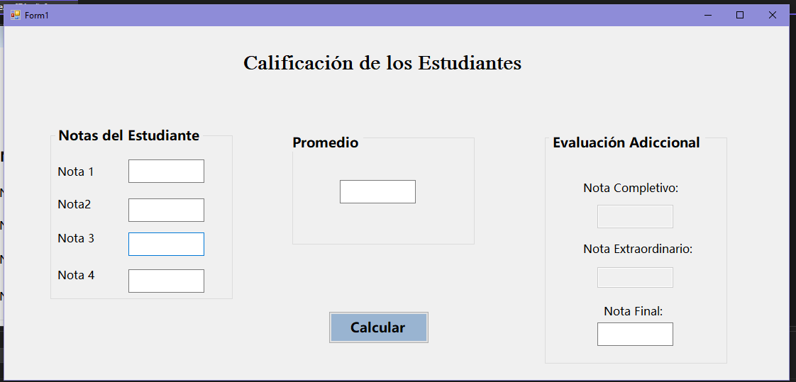
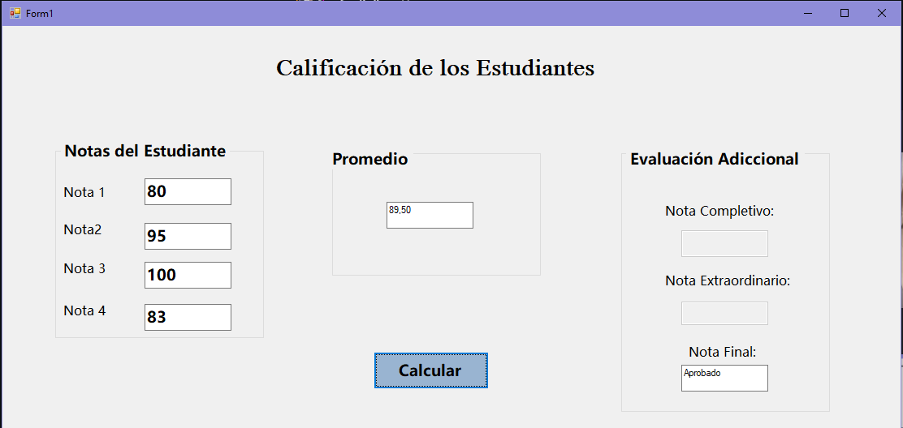
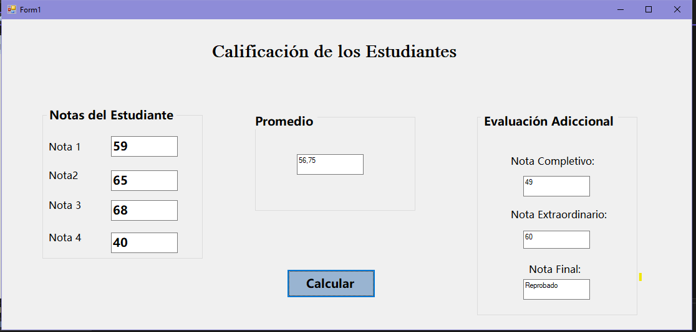

# 📚 Formulario de Calificación de Estudiantes

Aplicación en **C# Windows Forms** para el control académico.

---

## ✨ Descripción del Proyecto
Este proyecto permite registrar las calificaciones de un estudiante,  
calcular su promedio y determinar si aprueba, va a completivo o extraordinario.  
Fue desarrollado usando **C# y Windows Forms**, aplicando lógica condicional y validaciones.

---

## 🛠️ Tecnologías Utilizadas
- C# (.NET Framework)
- Windows Forms
- Visual Studio

---

## 📋 Funcionalidades
- Ingreso de 4 calificaciones  
- Cálculo automático del promedio  
- Activación de completivo (≤ 69)  
- Evaluación de extraordinario  

---

## 🖼️ Vista del formulario

  
  
  

